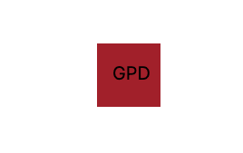
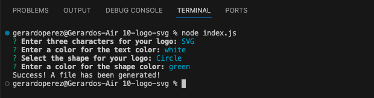
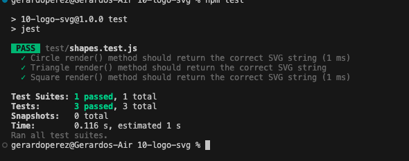

# SVG Logo Maker

## The Project

My project is about a Node.js command-line application that takes in user input to generate a logo and save it as an [SVG file](https://en.wikipedia.org/wiki/Scalable_Vector_Graphics). The application prompts the user to select a color and shape, provide text for the logo, and save the generated SVG to a `.svg` file. This will test my Object-oriented Programming skills and put them into practice. 

### User Story

```md
AS a freelance web developer
I WANT to generate a simple logo for my projects
SO THAT I don't have to pay a graphic designer
```

## Acceptance Criteria

```md
GIVEN a command-line application that accepts user input
WHEN I am prompted for text
THEN I can enter up to three characters
WHEN I am prompted for the text color
THEN I can enter a color keyword (OR a hexadecimal number)
WHEN I am prompted for a shape
THEN I am presented with a list of shapes to choose from: circle, triangle, and square
WHEN I am prompted for the shape's color
THEN I can enter a color keyword (OR a hexadecimal number)
WHEN I have entered input for all the prompts
THEN an SVG file is created named `logo.svg`
AND the output text "Generated logo.svg" is printed in the command line
WHEN I open the `logo.svg` file in a browser
THEN I am shown a 300x200 pixel image that matches the criteria I entered
```

## Usage

The following image shows a generated SVG given the following input entered by the user: `SVG` for the text, `white` for the text color, `circle` from the list of shapes, and `green` for the shape color. Note that this is just an image of the output SVG and not the SVG file itself:








## Installations

The application uses [Jest](https://www.npmjs.com/package/jest) for running the unit tests and [Inquirer](https://www.npmjs.com/package/inquirer/v/8.2.4) for collecting input from the user. The application will be invoked by using the following command:

```bash
node index.js
```

In addition, the following command is entered in order to install all dependencies needed prior to node index.js:

```bash
npm install
```

## Helpful links

[Repository](https://github.com/Gera1313/10-logo-svg)

[Video](https://youtu.be/yTYZvp4YYHU)

Other links: 

* [Scalable Vector Graphics (SVG)](https://en.wikipedia.org/wiki/Scalable_Vector_Graphics)

* [Basic SVG shapes](https://developer.mozilla.org/en-US/docs/Web/SVG/Tutorial/Basic_Shapes)

* [Text in SVG](https://developer.mozilla.org/en-US/docs/Web/SVG/Tutorial/Texts)

* [SVG VS Code extension](https://marketplace.visualstudio.com/items?itemName=jock.svg)

* https://www.w3schools.com/graphics/svg_circle.asp

* https://developer.mozilla.org/en-US/docs/Web/SVG/Element/circle

* https://www.svgviewer.dev/

* https://developer.mozilla.org/en-US/docs/Web/SVG/Tutorial/Basic_Shapes

## Credits

Those links mentioned above helped A LOT in trying to understand everything and with debugging. 